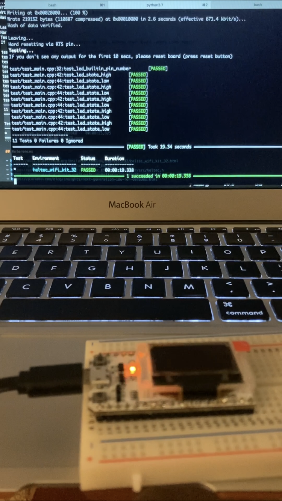

# Tiny Coin Ticker


## Hardware Setup

Using an ESP32 module [Heltec WiFi Kit 32](https://github.com/HelTecAutomation/Heltec_ESP32)

Install the [drivers](https://www.silabs.com/developers/usb-to-uart-bridge-vcp-drivers) to recognize the serial port connection to the board.

After installing and connecting the board the serial port should be listed:

```
> ls /dev/tty.*

...
/dev/tty.SLAB_USBtoUART
```

## Software Setup

[Platformio](https://docs.platformio.org/en/latest/core/quickstart.html) is the main development platform.

Create a new conda environment:

```
> conda create -n arduino python=3.7
> conda activate arduino
```

Install Platformio:

```
> conda install -c conda-forge platformio
```

Find the ESP32 board:

```
> platformio boards | egrep -i heltec
```

Initialize the directory structure for our board:

```
> pio project init --board heltec_wifi_kit_32
```

### Build

Clean, build and upload `main.cpp`:

```
> pio run -t clean
> pio run -e heltec_wifi_kit_32 -t upload
```

Monitor the serial port at 9600/[8-N-1](https://en.wikipedia.org/wiki/8-N-1):

```
> pio device monitor
```

or

```
> screen /dev/tty.SLAB_USBtoUART 9600 cs8 -parenb cstopb
> minicom -D /dev/tty.SLAB_USBtoUART -b 9600
```


### Tests

```
> pio test -e heltec_wifi_kit_32 --verbose
```

```
Collected 1 items

Processing * in heltec_wifi_kit_32 environment
----------------------------------------------
Building...
CONFIGURATION: https://docs.platformio.org/page/boards/espressif32/heltec_wifi_kit_32.html
PLATFORM: Espressif 32 (2.1.0) > Heltec WiFi Kit 32
HARDWARE: ESP32 240MHz, 320KB RAM, 4MB Flash
DEBUG: Current (esp-prog) External
PACKAGES:
 - framework-arduinoespressif32 3.10004.201016 (1.0.4)
 - tool-esptoolpy 1.30000.201119 (3.0.0)
 - toolchain-xtensa32 2.50200.80 (5.2.0)
LDF: Library Dependency Finder -> http://bit.ly/configure-pio-ldf
LDF Modes: Finder ~ chain, Compatibility ~ soft
Found 27 compatible libraries
Scanning dependencies...
Dependency Graph
|-- <Heltec ESP32 Dev-Boards> 1.1.0+sha.62228d5
|   |-- <SPI> 1.0
|   |-- <Wire> 1.0.1
Building in release mode
...
CURRENT: upload_protocol = esptool
MethodWrapper(["upload"], [".pio/build/heltec_wifi_kit_32/firmware.bin"])
Auto-detected: /dev/cu.SLAB_USBtoUART
...
esptool.py v3.0
Serial port /dev/cu.SLAB_USBtoUART
Connecting........____
Chip is ESP32-D0WDQ6 (revision 1)
Features: WiFi, BT, Dual Core, 240MHz, VRef calibration in efuse, Coding Scheme None
Crystal is 26MHz
MAC: b4:e6:2d:8a:10:e9
Uploading stub...
...
Writing at 0x00028000... (100 %)
Wrote 219152 bytes (110887 compressed) at 0x00010000 in 2.6 seconds (effective 670.5 kbit/s)...
Hash of data verified.

Leaving...
Hard resetting via RTS pin...
Testing...
If you don't see any output for the first 10 secs, please reset board (press reset button)

test/test_main.cpp:32:test_led_builtin_pin_number   [PASSED]
test/test_main.cpp:42:test_led_state_high   [PASSED]
test/test_main.cpp:44:test_led_state_low    [PASSED]
test/test_main.cpp:42:test_led_state_high   [PASSED]
test/test_main.cpp:44:test_led_state_low    [PASSED]
test/test_main.cpp:42:test_led_state_high   [PASSED]
test/test_main.cpp:44:test_led_state_low    [PASSED]
test/test_main.cpp:42:test_led_state_high   [PASSED]
test/test_main.cpp:44:test_led_state_low    [PASSED]
test/test_main.cpp:42:test_led_state_high   [PASSED]
test/test_main.cpp:44:test_led_state_low    [PASSED]
-----------------------
11 Tests 0 Failures 0 Ignored
==== [PASSED] Took 25.32 seconds ====

Test    Environment         Status    Duration
------  ------------------  --------  ------------
*       heltec_wifi_kit_32  PASSED    00:00:25.325
==== 1 succeeded in 00:00:25.325 ====
```



### Other

```
> ls -alt ~/.platformio/packages/
> ls ~/.platformio/packages/framework-arduinoespressif32/libraries/WiFi/src/WiFiType.h
> ls ~/.platformio/packages/framework-espidf/components/esp_wifi/include/esp_wifi_types.h
```

## References

- https://docs.platformio.org/en/latest/boards/espressif32/heltec_wifi_kit_32.html
- https://docs.platformio.org/en/latest/tutorials/espressif32/arduino_debugging_unit_testing.html
- https://docs.platformio.org/en/latest/tutorials/espressif32/espidf_debugging_unit_testing_analysis.html
- https://docs.espressif.com/projects/esp-idf/en/latest/esp32/api-guides/wifi.html
- https://github.com/HelTecAutomation/Heltec_ESP32
- https://github.com/HelTecAutomation/Heltec_ESP32/blob/master/src/heltec.h
- https://community.platformio.org/t/wifi-on-heltec-wifi-kit-32-not-compiling-found/8719
- https://hackaday.io/project/172317-facelock-a-facial-recognition-door-lock/log/179056-initializing-http-client-and-send-requests-with-esp32
- https://piolabs.com/blog/insights/next-generation-ide-for-decades.html
- https://www.nordicsemi.com/Software-and-Tools/Development-Tools/nRF-Connect-for-desktop
- https://apps.apple.com/us/app/nrf-connect-bluetooth-app/id1054362403
- https://arduinojson.org
